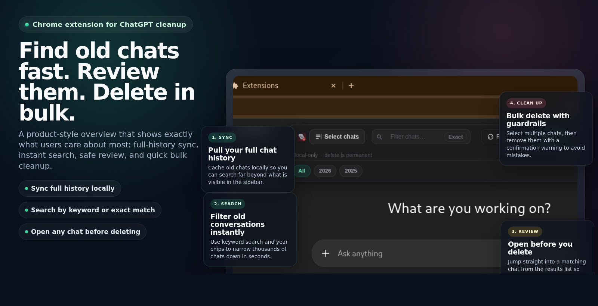
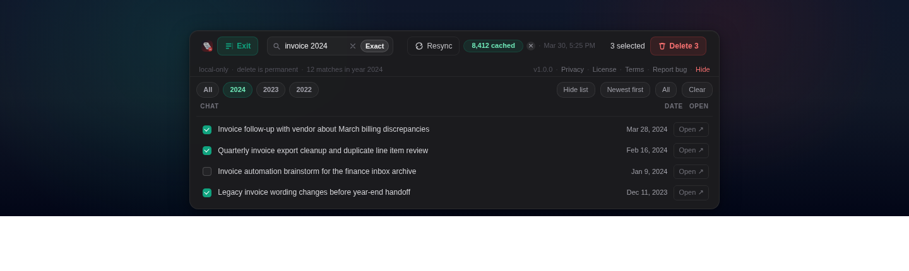
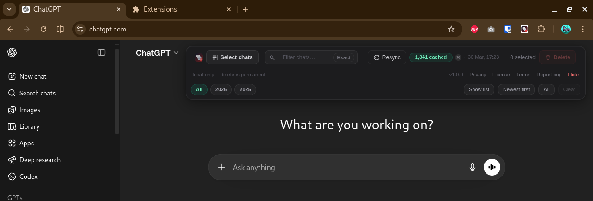
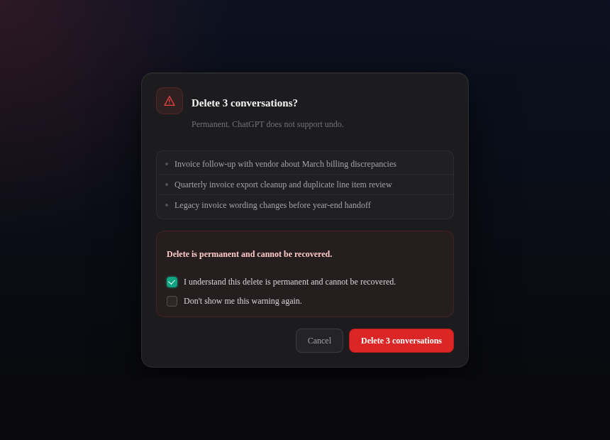

# ChatGPT Bulk Delete

Find old ChatGPT conversations fast, review them safely, and delete them in bulk.

Sync your full chat list into a local cache, search by keyword or exact words, open any result to double-check it, then remove multiple chats in one pass.

## Screenshots

### Overview

### In-app toolbar

### Full ChatGPT view

### Delete confirmation

## What It Does

- Syncs your ChatGPT chat list into a local cache
- Lets you search by keyword or exact words
- Opens any result in a new tab before you delete it
- Bulk deletes selected chats with a confirmation warning

## Install

Use the same downloaded ZIP for both Chrome and Firefox. The extension files are the same; only the browser-specific install steps differ.

### Chrome

1. On GitHub, click the green `Code` button.
2. Click `Download ZIP`.
3. Extract the ZIP to a normal folder on your computer.
4. Open `chrome://extensions`.
5. Turn on Developer mode.
6. Click `Load unpacked`.
7. Select the extracted folder.

### Firefox

1. On GitHub, click the green `Code` button.
2. Click `Download ZIP`.
3. Extract the ZIP to a normal folder on your computer.
4. Open `about:debugging#/runtime/this-firefox`.
5. Click `Load Temporary Add-on...`.
6. Select the `manifest.json` file inside the extracted folder.

Note: Firefox temporary add-ons are removed when the browser restarts unless the extension is packaged and signed for a normal release.

## Use

1. Open ChatGPT.
2. Click `Sync all`.
3. Search by keyword, exact words, or year.
4. Open a result in a new tab if you want to verify it first.
5. Select the chats you want.
6. Click `Delete`.

## Privacy

- No data is sent to any third-party server
- No analytics, trackers, or ads
- Cache is stored locally in your browser on `chatgpt.com`
- It only talks to ChatGPT/OpenAI endpoints already used by the site
- No extra extension permissions are requested

Full policy: [`PRIVACY.md`](PRIVACY.md)  
Terms: [`TERMS.md`](TERMS.md)

## License

Source-available, non-commercial.

- Personal and non-commercial use is allowed
- Commercial or corporate use is not allowed without permission
- If someone wants to use it commercially, they need a separate paid license

See [`LICENSE`](LICENSE).

## Notes

- `Resync` refreshes the cache if it gets stale.
- `Exact` stops partial matches like `car` matching `care`.
- `Clear local cache` only removes the extension's saved chat list on this browser.
- Runtime compatibility checks disable broken destructive actions if ChatGPT changes unexpectedly.
- Release notes: [`CHANGELOG.md`](CHANGELOG.md)
- Versioning guide: [`VERSIONING.md`](VERSIONING.md)
- Icons are in `icons/` and the source SVG is `icon-source.svg`.
