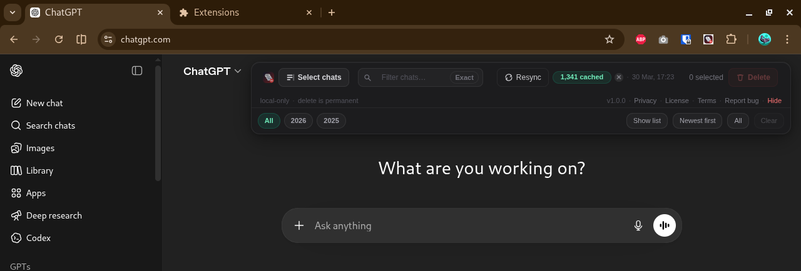
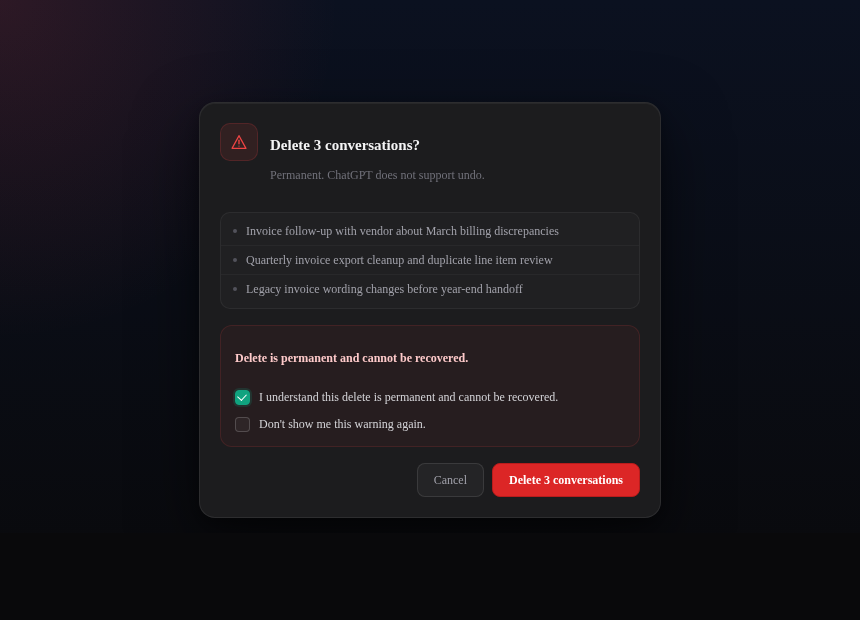

# ChatGPT Bulk Delete

Find old ChatGPT conversations and Library files, review them, and delete them in bulk.

Sync your full chat list into a local cache, search by keyword or exact words, open any result to double-check it, then remove multiple chats in one pass.

Chrome: [Install from Chrome Web Store](https://chromewebstore.google.com/detail/chatgpt-bulk-delete/nbecbefmhjidfmmfbpealakgpnnldcce?hl=en)  
Firefox: [Install from Firefox Add-ons](https://addons.mozilla.org/en-GB/firefox/addon/chatgpt-chat-bulk-delete/)

## Screenshots

### Full ChatGPT view

### Delete confirmation

## What It Does

- Syncs your ChatGPT chat list into a local cache
- Lets you search by keyword or exact words
- Filters synced chats by year and loaded Project chat membership
- Opens any result in a new tab before you delete it
- Bulk deletes selected chats with a confirmation warning
- Provides a separate Library mode to sync, search, select, and bulk-delete files

Download the versioned Chrome and Firefox submission ZIPs from [GitHub Releases](https://github.com/johnvouros/ChatGPT-bulk-delete-chats/releases). Store listings may remain on the previous version until review is complete.

## Install

### Chrome

Install from the Chrome Web Store:

- [ChatGPT Bulk Delete](https://chromewebstore.google.com/detail/chatgpt-bulk-delete/nbecbefmhjidfmmfbpealakgpnnldcce?hl=en)

Manual dev install if you want the unpacked version:

1. On GitHub, click the green `Code` button.
2. Click `Download ZIP`.
3. Extract the ZIP to a normal folder on your computer.
4. Open `chrome://extensions`.
5. Turn on Developer mode.
6. Click `Load unpacked`.
7. Select the extracted folder.

### Firefox

Install from Firefox Add-ons:

- [ChatGPT Chat Bulk Delete](https://addons.mozilla.org/en-GB/firefox/addon/chatgpt-chat-bulk-delete/)

Manual dev install if you want the temporary unpacked version:

1. On GitHub, click the green `Code` button.
2. Click `Download ZIP`.
3. Extract the ZIP to a normal folder on your computer.
4. Open `about:debugging#/runtime/this-firefox`.
5. Click `Load Temporary Add-on...`.
6. Select the `manifest.json` file inside the extracted folder.

Note: Firefox temporary add-ons are removed when the browser restarts unless you use the signed Add-ons store version above.

## Use

1. Open ChatGPT.
2. Click `Sync all`.
3. Search by keyword, exact words, or year.
4. Open a result in a new tab if you want to verify it first.
5. Select the chats you want.
6. Click `Delete`.

### Library files

Switch the toolbar to `Library`; the file list syncs automatically. ChatGPT now exposes files under [Space files](https://chatgpt.com/space/files?tab=images). Opening that page selects Library mode automatically; the older `/library` route is also supported. The extension uses its own file list and filename filter: ChatGPT’s Images/Uploads tabs do not restrict the extension’s selection. After refresh, Library mode is restored and sync starts again, with tiles appearing as each page arrives. Search by filename and select files once loading finishes. Review the file names in the confirmation before continuing. Library deletion has its own mandatory confirmation, even if chat warnings are disabled.

Library shows a five-column thumbnail grid on desktop, with fewer columns on smaller screens. `Select all` selects every file matching the current search, including files beyond the currently displayed tiles. Review the total and file names before confirming.

Library metadata, signed thumbnail URLs, and previews stay in tab memory only. No Library data is written to localStorage, sessionStorage, IndexedDB, or the Cache API. Old Library metadata caches from the development version are removed automatically. Previews are fetched on demand with `cache: "no-store"`; object URLs are revoked when files are removed or the view is cleared. Reloading automatically starts a fresh sync when Library mode is active; only the toolbar mode preference is saved. The separate conversation cache is unchanged.

This prevents persistent caching by the extension; it cannot erase thumbnails previously cached by ChatGPT itself, browser history, downloads, or operating-system artifacts. Deleting chats does not automatically delete Library files.

Library support uses undocumented ChatGPT endpoints. The current `items`/`cursor` listing was checked against a live account. The adapter skips folders and uses ChatGPT’s current `DELETE /backend-api/files/library/files/{id}` request with `soft_delete=true`, requiring an explicit JSON `success: true`. It pauses the batch on failures or unknown responses. This replaces the older streaming endpoint suggested in [issue #7](https://github.com/johnvouros/ChatGPT-bulk-delete-chats/issues/7). Library syncing and deletion were manually tested successfully by the maintainer before the 1.2.0 release.

A failed initial sync clears partial results; a failed resync restores the previous complete list. Clear session and failed syncs do not trigger repeated automatic retries; use Resync Library when ready.

Development checks: run `npm test`. The optional browser smoke test runs with `node scripts/library-browser-smoke.cjs` when Playwright and Chromium are available (`PLAYWRIGHT_MODULE` can point to an existing installation). Run `node scripts/library-auto-sync-smoke.cjs` for automatic/progressive sync coverage. All browser requests are intercepted and use mock data.

## Privacy

- No data is sent to any third-party server
- No analytics, trackers, or ads
- Conversation metadata is cached locally; Library metadata and thumbnails are session-only
- It only talks to ChatGPT/OpenAI endpoints already used by the site
- No extra extension permissions are requested

Full policy: [`PRIVACY.md`](PRIVACY.md)  
Terms: [`TERMS.md`](TERMS.md)

## License

Source-available, non-commercial.

- Personal and non-commercial use is allowed
- Commercial or corporate use is not allowed without permission
- If someone wants to use it commercially, they need a separate paid license

See [`LICENSE`](LICENSE).

## Notes

- `Resync` refreshes the cache if it gets stale.
- `Exact` stops partial matches like `car` matching `care`.
- Project chat filters work after you open a Project from the ChatGPT sidebar and scroll its chat list.
- `Clear local cache` only removes the extension's saved chat list on this browser.
- Runtime compatibility checks disable broken destructive actions if ChatGPT changes unexpectedly.
- Release notes: [`CHANGELOG.md`](CHANGELOG.md)
- Versioning guide: [`VERSIONING.md`](VERSIONING.md)
- Icons are in `icons/`; the current cropped source PNG plus Chrome Web Store and Firefox Add-ons upload icons are in `docs/store-assets/`.
